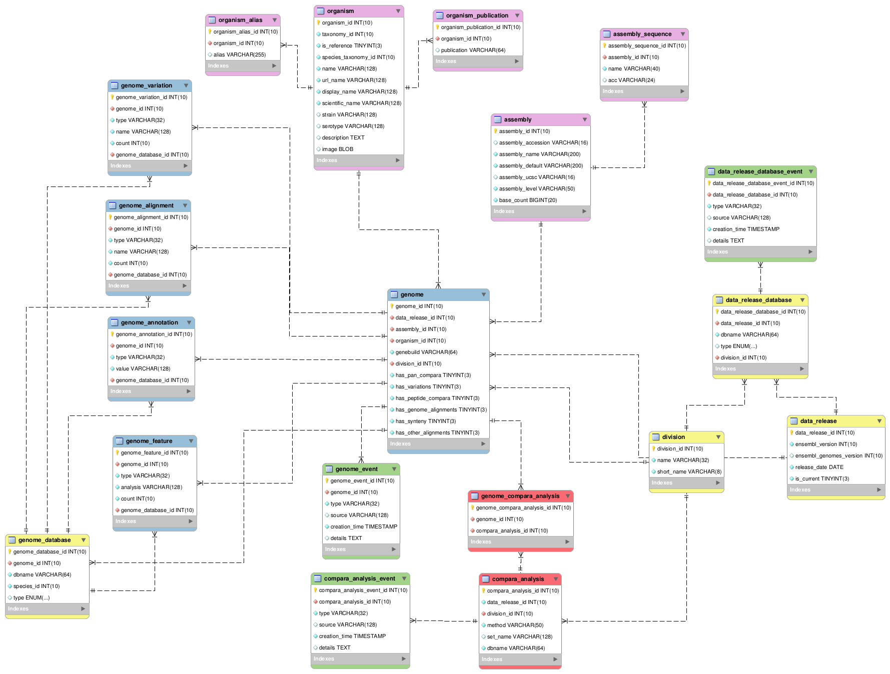

# ensembl-metadata
An API for storing and querying metadata about Ensembl and Ensembl Genomes releases. It can be used to find information about current and historic data releases, and also to retrieve DBAdaptor objects for use with the Ensembl Perl API without needing to use the Registry.

# Installation
This API requires the following Ensembl APIs (including their Perl dependencies):
- [ensembl](https://github.com/Ensembl/ensembl)
- [ensembl-taxonomy](https://github.com/Ensembl/ensembl-taxonomy)
- [ensembl-hive](https://github.com/Ensembl/ensembl-hive) (only if load pipelines are used)

In addition, additional Perl modules are required, listed in [the cpan dependency file](cpanfile).

# Usage

Full Perl documentation can be found at http://ensembl.github.io/ensembl-metadata/.

Some usage examples are shown below. Example scripts can also be found in the [misc-scripts](misc-scripts) directory. 

## Basic usage
The main entry point for this API is the GenomeInfoAdaptor. This can be retrieved in a number of ways:
```
# create an adaptor to work with Ensembl
my $e_gdba = Bio::EnsEMBL::MetaData::DBSQL::GenomeInfoAdaptor->build_ensembl_adaptor();

# or create an adaptor to work with Ensembl Genomes
my $eg_gdba = Bio::EnsEMBL::MetaData::DBSQL::GenomeInfoAdaptor->build_ensembl_genomes_adaptor();

# finding from the registry
Bio::EnsEMBL::Registry->load_all("configuration_file");
my $gdba = Bio::EnsEMBL::Registry->get_DBAdaptor("multi", "metadata")->get_GenomeInfoAdaptor();

# building your own
my $dba = Bio::EnsEMBL::MetaData::DBSQL::MetaDataDBAdaptor->new(
	-USER=>'anonymous',
	-HOST=>'ensembldb.ensembl.org',
	-PORT=>'5306',
	-DBNAME=>'ensembl_metadata'
);
my $gdba = $dba->get_GenomeInfoAdaptor();
```

Information about genomes is encapsulated in GenomeInfo objects, which can be found in a number of ways from the adaptor:
```
# find and iterate over all genomes
for my $genome (@{$gdba->fetch_all()}) {
	print $genome->name()."\n";
}
# find and iterate over all genomes from Ensembl Plants
for my $genome (@{$gdba->fetch_all_by_division("EnsemblPlants")}) {
	print $genome->name()."\n";
}
# find genomes from part of the taxonomy
for my $genome (@{$gdba->fetch_all_by_taxonomy_branch(2157)}) {
	print $genome->name()."\n";
}
# find genomes with variation data
for my $genome (@{$gdba->fetch_all_with_variation())}) {
	print $genome->name()."\n";
}
```

To work with compara data, use the GenomeComparaInfoAdaptor:
```
# find all comparas for the division of interest
my $comparas = $gdba->db()->get_GenomeComparaInfoAdaptor()->fetch_all_by_division('EnsemblPlants');
# find the peptide compara
my ($compara) = grep {$_->is_peptide_compara()} @$comparas;
print $compara->division()." ".$compara->method()."(".$compara->dbname().")\n";

# print out all the genomes in this compara
for my $genome (@{$compara->genomes()}) {
	print $genome->name()."\n";
}
```

## Working with releases
By default, the adaptor uses the last release available but historical releases are available and can be set on the adaptor:
```
# set to use EG 30
$gdba->set_ensembl_genomes_release(30);
# now uses EG 30
for my $genome (@{$gdba->fetch_all()}) {
	print $genome->name()."\n";
}
```

## Instantiating DBAdaptors
The LookUp module uses the metadata API to create DBAdaptors for genomes that can then be used with the Ensembl Perl API.
```
my $lookup = Bio::EnsEMBL::LookUp->new();
my $taxid = 7215;
print "Finding descendants for $taxid\n";
my @dbas = @{$lookup->get_all_by_taxon_branch($taxid)};
print "Found ".scalar @dbas." descendants\n";
for my $dba (@dbas) {
  my $genes = $dba->get_GeneAdaptor()->fetch_all();
  print "Found " .
	scalar @$genes . " genes for " . $dba->species() . "\n";
}
```
Note that a DBAdaptor can also be created directly from a GenomeInfo object via the RemoteLookUp genome_to_dba method.

# Implementation
## API object model
The `ensembl-metadata` API follows the same conventions as the core Ensembl APIs, with data objects stored and retrieved in the database via adaptors. For each of the following objects, there is a corresponding adaptor e.g. GenomeInfo is handled by GenomeInfoAdaptor. The adaptor is responsible for storing/updating objects, and for fetching them from the database.

### GenomeInfo
The central object in the implementation is GenomeInfo, which represents a specific version of a _genome_ from a specific release. Besides attributes such as annotation, genebuild etc., it also encapsulates an AssemblyInfo object and an OrganismInfo object.

### AssemblyInfo
This represents a particular assembly of a genome, and is independent of data releases. It also provides access to a list of top-level sequence. Note that Assembly is independent of Organism. This is because the taxonomy of an organism can change extensively following the release of an assembly. Currently GenomeInfo represents the intersection of assembly and organism.

### OrganismInfo
This represents a particular organism (regardless of taxonomic rank), and is independent of a data release. 

### GenomeComparaInfo
This object associates sets of GenomeInfo objects with a particular comparative genomics analysis (gene trees, whole genome alignments etc.)

### DataRelease
This represents a specific version of Ensembl or Ensembl Genomes, and is associated with sets of GenomeInfo objects, and also with DatabaseInfo objects for databases that aren't tied to any particular genome or compara (marts etc.)

### EventInfo
This represents an event that has happened to a piece of data, and can be attached to . This currently has a type, a source, a subject (i.e. an instance of GenomeInfo)

## Data schema
The following diagram shows the MySQL schema used by `ensembl-metadata`. The colour scheme indicates:
- blue = release-specific genome data
- pink = organism and assembly data (release dependent)
- red = comparative genomics data
- yellow = release information (database names, data releases)
- green = event history

<a href="sql/table.png"></a>

## LookUp
Bio::EnsEMBL::LookUp is a base class providing access to DBAdaptors without the need to query all core DBAdaptors via the Registry, which does not scale with 1000s of genomes.
There are two implementations, LocalLookUp (which uses an internal hash) and RemoteLookUp (which uses the metadata database). 

### LocalLookUp
LocalLookUp queries all databases in the registry and stores details in an internal hash which is then used for successive fetch calls. After an initial load, this hash is stored on disk as lookup_cache.json and then reloaded as required. A JSON file of this kind can also be supplied as a constructor argument.

DBAdaptors returned are those referenced by the original registry, or constructed using the properties of the original adaptors.

### RemoteLookUp
RemoteLookUp uses an instance of Bio::EnsEMBL::MetaData::DBSQL::GenomeInfoAdaptor to find details of genomes to instantiate.

The DBAdaptors returned are constructed using MySQL details supplied by an instance of Bio::EnsEMBL::MetaData::DBSQL::MySQLServerProvider. By default, this provider supplies the details of the Ensembl or Ensembl Genomes public MySQL servers as determined by the division to which the genome belongs. Alternative implementations can be supplied, including Bio::EnsEMBL::MetaData::DBSQL::ParameterMySQLServerProvider which is instantiated internally where the standard -USER, -HOST etc. arguments passed to RemoteLookUp.

### PublicMySQLServer
Bio::EnsEMBL::Utils::PublicMySQLServer contains the credentials for accessing the Ensembl and Ensembl Genomes public MySQL servers.
